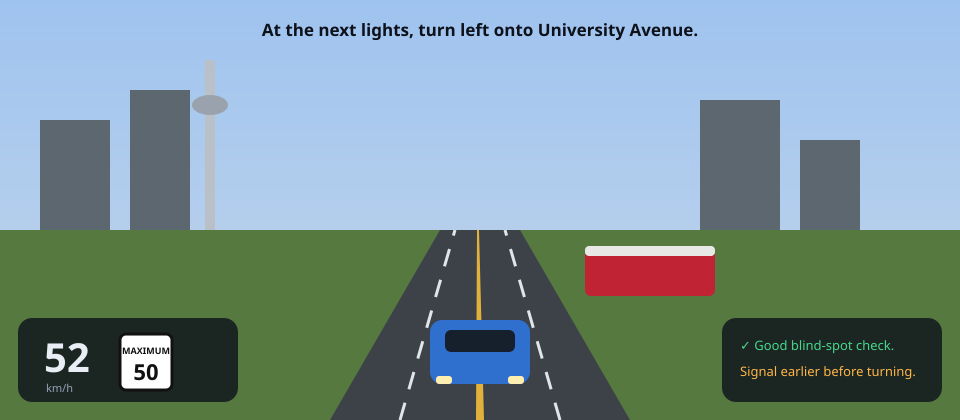

# DriveSim — Ontario Full G Road Test Trainer

A browser-based, Toronto-flavoured driving simulator built to train for the **Ontario Full G road test** (the G2-exit test). Drive a physically-modelled car through a living district — downtown signals with advanced greens, streetcars, a school zone, a roundabout, parallel-parking bays, a real hill, and a 400-series highway loop with proper ramps — while a coaching engine grades you exactly the way a DriveTest examiner would, then take a fully routed, spoken, scored **mock G test**.

> ⚠️ **DriveSim is a practice aid.** It is not a substitute for real supervised road time or the official [MTO Driver's Handbook](https://www.ontario.ca/document/official-mto-drivers-handbook).



## Live demo

**https://soldoutbudokan.github.io/DriveSim/** — deployed automatically from `main` by GitHub Actions (first-time setup: repo **Settings → Pages → Source: GitHub Actions**, then push to `main`).

## What's inside

- **Free Roam** — the whole district with live, non-nagging coaching toasts.
- **Lessons (1–5)** — a sequenced curriculum: vehicle basics & smoothness → intersections & right-of-way (advanced green, RTOR, all-way stops, PXO) → low-speed maneuvers (parallel park with curb-distance grading, three-point turn, roadside stop, hill start with rollback measured) → roundabout & lane-change ritual → Highway 401 merge/maintain/exit. Each lesson has live task checks, a 3D target beacon, minimap routing, and a fault-by-fault summary.
- **Mock G Test** — a spoken examiner (SpeechSynthesis) runs a ~7 km route covering city + all four maneuvers + the highway, grades **silently** into a DriveTest-style weighted rubric (9 assessment areas, minor/major/dangerous/auto-fail severities), and hands you a full report card with prioritized "work on these next" recommendations that launch the right lesson.
- **Replays** — every drive is recorded (20 Hz, typed-array packed, IndexedDB). Scrub the timeline, jump to fault markers, watch from follow-cam or a free orbit camera.
- **Telemetry** — speed-vs-limit trace, following-distance distribution, hard-brake/steer events, drive-path error heatmap, mirror-check cadence and blind-spot compliance, feeding the adaptive practice recommendations.
- **Profiles** — multiple drivers, per-profile progress + replays, reset/delete.

## Controls

Press **`?`** in-app any time — it pins a controls panel to the right edge that stays up while you drive (press again to hide; the choice is remembered).

| Keyboard | Action |
| --- | --- |
| `W` / `↑` | Accelerate (in the selected gear) |
| `S` / `↓` | Brake |
| `X` | Shift Drive ↔ Reverse (when stopped) |
| `A` `D` / `←` `→` | Steer |
| `Shift` | Gentle / precise throttle |
| `Space` | Handbrake (hold at a stop = Park) |
| `Q` / `E` | Left / right turn signal (auto-cancels after the turn) |
| `,` / `.` | **Left / right shoulder (blind-spot) check** |
| `M` | **Mirror check** (rear-view inset) |
| `C` / `V` | Cycle camera / cockpit view |
| `L` · `U` · `H` · `Tab` | Headlights · wipers · horn · hazards |
| `R` / `P` / `?` | Respawn · pause · pin/unpin the controls panel |

| Gamepad | Action |
| --- | --- |
| Left stick / RT / LT | Steer / accelerate / brake |
| A (Cross) | Drive ↔ Reverse |
| LB / RB | Signals |
| D-pad ◀ ▶ / X (Square) | Shoulder checks / mirror check |
| Y (Triangle) · B (Circle) · D-pad ▼ | Camera · horn · handbrake |
| Start / Back | Pause / help |

The shoulder-check and mirror-check keys are **core pedagogy**: the scoring engine checks that you performed them at the right moments (before every lane change, merge, and pull-away — merging without a shoulder check is an automatic fail, as on the real test).

## Ontario rules & skills covered

Full Ontario signal phases incl. **advanced green / protected left arrows** · **right-turn-on-red after a complete stop** · two-way & four-way stops with arrival order · uncontrolled right-of-way & left turns across oncoming · **roundabout** yield-on-entry / signal-on-exit · **pedestrian crossovers (PXO)** — stop until completely clear · **streetcars** — never pass open doors, stop 2 m behind · **school buses** — stop both directions when flashing · **emergency vehicles** — pull right and stop · school / construction / playground zones with reduced limits · **HOV 2+ lanes** with diamond markings · highway merging (signal + shoulder check + match speed), maintaining 100 km/h with a 2–3 s gap (tightened in rain/snow), multi-lane changes, decelerate-on-the-ramp exits · parallel parking ≤ 30 cm from the curb · three-point turns in three moves · roadside stops & safe re-entry · stop-park-start on a grade with near-zero rollback · headlights at night, wipers in rain, smoothness and lane discipline throughout.

## Run locally

```bash
npm install
npm run dev        # Vite dev server
npm test           # physics / network / traffic / rubric / replay suites
npm run build      # type-check + production build to dist/
npm run preview    # serve the production build
```

## Deploying to GitHub Pages

`.github/workflows/deploy.yml` builds, tests and deploys `dist/` to Pages on every push to `main`. One-time setup: **Settings → Pages → Source: GitHub Actions**.

The Vite config uses `base: './'` (relative asset URLs), so the build works at `https://<user>.github.io/<any-repo-name>/` **without changes even if you rename the repo** — only the live URL above would change.

## Tech stack & architecture

**Vite + TypeScript (strict) + Three.js (WebGL2)**, Web Audio API (all sounds synthesized — zero audio assets), Gamepad API, SpeechSynthesis for the examiner, localStorage + IndexedDB for persistence. Everything is procedural geometry and canvas-generated textures; no asset pipeline.

```
src/
  core/        engine loop, events, math, quality tiers (auto 60 fps target)
  vehicle/     bicycle-model dynamics: Pacejka tires + friction circle, weight
               transfer, torque-converter automatic, ABS, handbrake, grade forces
  physics/     2D OBB/circle collision with spatial hashing
  controls/    keyboard analog emulation + gamepad mapping
  camera/      chase / cockpit / top-down + shoulder-glance & mirror views
  audio/       procedural engine (RPM-pitched), blinker, skid, wind, rain,
               horn, impacts, positional siren, streetcar bell, ambient city
  world/       road network graph → lanes/turns/controls, procedural roads &
               markings, Ontario signals (advanced green, PXO), props/buildings
  traffic/     IDM car-following agents with full rule obedience, streetcar,
               school bus, emergency vehicles, pedestrians, cyclists
  weather/     day/night cycle, rain/fog/snow with grip + visibility effects
  coaching/    DriveContext tracker + 16 graded habit rules + the coach
  scoring/     DriveTest-style weighted rubric + report computation
  examiner/    routed spoken mock test with maneuver grading + re-routing
  replay/      typed-array recorder/codec + scrubbable player with ghosts
  telemetry/   post-drive analytics dashboard + adaptive recommendations
  scenarios/   the lesson curriculum definitions
  game/        app shell, modes, lesson runner, settings, progress
  persistence/ profiles + IndexedDB replay store
  ui/          HUD, minimap, menus, report card, styles
```

**Physics**: a dynamic single-track (bicycle) model — Pacejka lateral forces per axle, longitudinal/lateral combination through a friction circle (throttle-on understeer, handbrake oversteer emerge naturally), longitudinal weight transfer feeding axle loads, surface/weather grip multipliers, road-grade forces (hills genuinely roll back), kinematic blending below ~3.5 m/s for parking-speed sanity, 240 Hz substeps.

**Traffic**: Intelligent Driver Model car-following over lane polylines with per-lane occupancy, signal obedience including amber dilemma decisions and RTOR, all-way arrival queues (the player participates), gap-accepted lane changes & mandatory merges, and right-of-way primitives shared with the coaching engine.

## Roadmap

- [ ] Mobile touch controls
- [ ] More test routes + route randomization for the examiner
- [ ] Winter package: snow accumulation, plows, black-ice patches
- [ ] G1-exit (G2 test) variant without the highway component
- [ ] Localized examiner voices and instruction phrasing

## License

MIT — built as a personal training aid. Drive safe; book real lessons.
